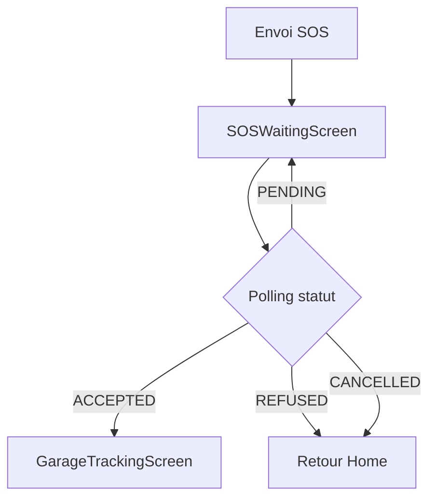

# 🚨 Guide Complet du Flux SOS

## 📋 Vue d'ensemble du flux

Le flux SOS complet est maintenant implémenté avec les étapes suivantes :

### 1️⃣ **BreakdownSOSScreen** - Envoi de la demande SOS
- Vérification des permissions GPS
- Détection automatique de la position GPS OU sélection manuelle sur la carte
- Formulaire de demande (type de panne, description, photo)
- Envoi de la demande au backend

### 2️⃣ **SOSWaitingScreen** - Attente de la confirmation du garage
- Affichage d'une animation de chargement
- Polling automatique toutes les 5 secondes pour vérifier le statut
- Statuts possibles : PENDING → ACCEPTED/REFUSED
- Navigation automatique vers le tracking si ACCEPTED

### 3️⃣ **GarageTrackingScreen** - Suivi en temps réel du dépanneur
- Affichage de la carte avec 2 marqueurs :
  - 🔴 Position du client (panne)
  - 🟢 Position du dépanneur (simulée)
- Trajet entre les deux positions
- Temps estimé d'arrivée
- Bouton d'appel direct au garage

---

## 🗺️ Sélection de Position Manuelle

### Comment ça marche ?

1. **Détection GPS automatique**
   - Au démarrage, l'app tente de détecter la position GPS
   - Si succès ✅ : Position affichée sur la carte

2. **Si le GPS ne fonctionne pas** (émulateur ou pas de signal)
   - Message d'erreur explicite
   - Bouton "Choisir ma position sur la carte"
   - Position par défaut : Tunis (36.8065, 10.1815)

3. **Sélection manuelle**
   - 👉 **Touchez n'importe où sur la carte**
   - Le marqueur rouge se déplace instantanément
   - Les coordonnées sont mises à jour automatiquement
   - Indication visuelle : "📍 Position manuelle sélectionnée"

4. **Ajustement de la position**
   - À tout moment, vous pouvez toucher la carte pour ajuster
   - Le bouton 🔄 permet de réessayer avec le GPS

### Code correspondant

Dans `BreakdownSOSScreen.kt` :
```kotlin
OpenStreetMapView(
    latitude = latitude,
    longitude = longitude,
    zoom = 15.0,
    markerTitle = if (isManualLocation) "Position choisie" else "Votre position GPS",
    onLocationSelected = onLocationSelected  // ← Callback pour sélection manuelle
)
```

Dans `OpenStreetMapView.kt` :
```kotlin
// Écouteur de clic sur la carte
onLocationSelected?.let { callback ->
    overlays.add(object : org.osmdroid.views.overlay.Overlay() {
        override fun onSingleTapConfirmed(
            e: android.view.MotionEvent,
            mapView: MapView
        ): Boolean {
            val geoPoint = projection.fromPixels(e.x.toInt(), e.y.toInt()) as GeoPoint
            callback(geoPoint.latitude, geoPoint.longitude)  // ← Notifie la nouvelle position
            return true
        }
    })
}
```

---

## ✅ Flux de Confirmation du Garage

### Navigation automatique selon le statut



### Polling du statut

Dans `SOSWaitingScreen.kt` :
```kotlin
LaunchedEffect(breakdownId) {
    while (true) {
        val result = onGetBreakdownStatus(breakdownId)
        result.onSuccess { breakdown ->
            breakdownStatus = breakdown
            
            when (breakdown.status.uppercase()) {
                "ACCEPTED" -> {
                    delay(1000)  // Petite pause pour afficher l'info
                    onGarageAccepted(breakdown)  // ← Navigation automatique
                    return@LaunchedEffect
                }
                "REFUSED" -> {
                    delay(2000)
                    onGarageRefused()
                    return@LaunchedEffect
                }
            }
        }
        
        delay(5000)  // Vérifier toutes les 5 secondes
    }
}
```

### États de la demande

| Statut | Description | Action |
|--------|-------------|--------|
| `PENDING` | En attente de réponse du garage | Continue le polling |
| `OPEN` | Même comportement que PENDING | Continue le polling |
| `ACCEPTED` | Garage a accepté ✅ | → Navigation vers `GarageTrackingScreen` |
| `REFUSED` | Garage a refusé ❌ | → Retour à l'accueil |
| `CANCELLED` | Demande annulée | → Retour à l'accueil |

---

## 🚗 Suivi du Dépanneur

### Affichage de la carte

Dans `GarageTrackingScreen.kt` :
```kotlin
// Position du client (panne)
val clientLocation = GeoPoint(breakdown.latitude, breakdown.longitude)

// Position du dépanneur (simulée - avance progressivement)
var garageLocation by remember { 
    mutableStateOf(
        GeoPoint(
            (breakdown.latitude ?: 36.8065) - 0.05,  // 5km au sud
            (breakdown.longitude ?: 10.1815) - 0.05
        )
    )
}
```

### Simulation du mouvement

```kotlin
LaunchedEffect(Unit) {
    while (estimatedTime > 0) {
        delay(3000)  // Toutes les 3 secondes
        
        // Rapprocher le dépanneur du client
        garageLocation = GeoPoint(
            garageLocation.latitude + (clientLocation.latitude - garageLocation.latitude) * 0.05,
            garageLocation.longitude + (clientLocation.longitude - garageLocation.longitude) * 0.05
        )
        
        // Mettre à jour distance et temps
        distanceKm = (distanceKm * 0.95).coerceAtLeast(0.1)
        estimatedTime = (distanceKm * 3).toInt().coerceAtLeast(1)
        
        // Mettre à jour la carte
        mapView?.invalidate()
    }
}
```

### Informations affichées

- ⏱️ **Temps estimé** : Calculé dynamiquement (~3 min par km)
- 📍 **Distance** : Mise à jour en temps réel
- 📱 **Bouton d'appel** : Appel direct au garage
- 💬 **Bouton de chat** : Message au dépanneur

---

## 🔧 Configuration Backend

### API Endpoints utilisés

1. **POST /breakdowns** - Créer une demande SOS
```json
{
  "vehicleId": "optional",
  "type": "PNEU | BATTERIE | MOTEUR | CARBURANT | REMORQUAGE | AUTRE",
  "description": "Description optionnelle",
  "latitude": 36.8065,
  "longitude": 10.1815,
  "photo": "url_photo_optionnelle"
}
```

2. **GET /breakdowns/:id** - Récupérer le statut
```json
{
  "id": "breakdown_id",
  "status": "PENDING | ACCEPTED | REFUSED | CANCELLED",
  "latitude": 36.8065,
  "longitude": 10.1815,
  "type": "PNEU",
  "description": "...",
  "createdAt": "2025-12-05T13:58:07.343Z"
}
```

### Modèle de données

```kotlin
data class BreakdownResponse(
    val id: String,
    val userId: String?,
    val vehicleId: String?,
    val garageId: String?,
    val type: String,
    val description: String?,
    val status: String,  // PENDING, ACCEPTED, REFUSED, CANCELLED
    val latitude: Double?,
    val longitude: Double?,
    val photo: String?,
    val createdAt: String?,
    val updatedAt: String?
)
```

---

## 📱 Utilisation dans l'Application

### Navigation dans NavGraph.kt

Le flux est déjà configuré dans `NavGraph.kt` :

```kotlin
// 1. Écran SOS
composable(Screen.SOS.route) {
    BreakdownSOSScreen(
        onBackClick = { navController.popBackStack() },
        onSOSSuccess = { breakdownId, type, lat, lon ->
            if (breakdownId != null) {
                // ← Navigation vers l'écran d'attente
                navController.navigate(Screen.SOSWaiting.createRoute(breakdownId)) {
                    popUpTo(Screen.SOS.route) { inclusive = true }
                }
            }
        }
    )
}

// 2. Écran d'attente
composable(Screen.SOSWaiting.route) { backStackEntry ->
    val breakdownId = backStackEntry.arguments?.getString("breakdownId") ?: ""
    
    SOSWaitingScreen(
        breakdownId = breakdownId,
        onGarageAccepted = { breakdown ->
            // ← Navigation vers le tracking
            navController.navigate(Screen.GarageTracking.createRoute(breakdown.id)) {
                popUpTo(Screen.SOSWaiting.route) { inclusive = true }
            }
        },
        onGarageRefused = {
            navController.navigate(Screen.Home.route) {
                popUpTo(Screen.SOSWaiting.route) { inclusive = true }
            }
        },
        onBackClick = { navController.popBackStack() },
        onGetBreakdownStatus = { id -> viewModel.getBreakdownStatus(id) }
    )
}

// 3. Écran de tracking
composable(Screen.GarageTracking.route) { backStackEntry ->
    val breakdownId = backStackEntry.arguments?.getString("breakdownId") ?: ""
    
    GarageTrackingScreen(
        breakdown = breakdown,
        onBackClick = { 
            navController.navigate(Screen.Home.route) {
                popUpTo(Screen.GarageTracking.route) { inclusive = true }
            }
        }
    )
}
```

---

## 🎯 Instructions pour Tester

### Sur Émulateur Android

1. **Démarrer l'émulateur**
2. **Lancer l'application**
3. **Aller dans Paramètres → SOS**
4. **Le GPS ne fonctionnera pas**, donc :
   - Message d'erreur s'affiche
   - Cliquer sur **"Choisir ma position sur la carte"**
5. **Toucher la carte** pour sélectionner votre position
6. **Remplir le formulaire** :
   - Sélectionner un type de panne
   - Ajouter une description (optionnel)
7. **Envoyer la demande**
8. **Écran d'attente** s'affiche avec animation
9. **Backend doit mettre à jour le statut** à "ACCEPTED"
10. **Navigation automatique** vers l'écran de tracking
11. **Observer le mouvement** du dépanneur sur la carte

### Sur Appareil Réel

1. **Activer le GPS**
2. **Sortir à l'extérieur** (meilleure réception)
3. **Lancer l'app et aller dans SOS**
4. **Position GPS détectée automatiquement** 📡
5. **Vous pouvez toujours ajuster** en touchant la carte
6. **Suivre les mêmes étapes** que l'émulateur

---

## 🐛 Résolution de Problèmes

### Problème : Position GPS non détectée sur émulateur

**Solution** :
1. Ouvrir **Extended Controls** (⋮) dans l'émulateur
2. Aller dans **Location**
3. Définir une position (ex: 36.8065, 10.1815 pour Tunis)
4. OU utiliser la sélection manuelle sur la carte

### Problème : Le statut reste PENDING

**Causes possibles** :
- Backend ne met pas à jour le statut
- Garage ne reçoit pas la notification
- Problème de connexion réseau

**Vérifier** :
- Logs du backend : `node server.js`
- Logs de l'app : `adb logcat | grep "SOSWaiting"`
- État de la requête dans la base de données

### Problème : Navigation ne fonctionne pas

**Vérifier** :
- `NavGraph.kt` contient bien toutes les routes
- Les imports sont corrects
- Pas d'erreurs de compilation

---

## 📊 Statuts et Codes de Réponse

### Statuts de la demande SOS

| Code | Signification | UI |
|------|---------------|-----|
| `PENDING` | En attente | ⏳ Animation de chargement |
| `OPEN` | Ouverte | ⏳ Même que PENDING |
| `ACCEPTED` | Acceptée | ✅ Navigation vers tracking |
| `REFUSED` | Refusée | ❌ Message + retour home |
| `CANCELLED` | Annulée | ⚠️ Retour à l'accueil |
| `IN_PROGRESS` | En cours | 🚗 Dépanneur en route |
| `COMPLETED` | Terminée | ✅ Intervention terminée |

---

## 🎨 UI/UX

### Indicateurs visuels

- **GPS détecté** : Badge bleu 📡 "Position GPS détectée"
- **Position manuelle** : Badge violet 📍 "Position manuelle sélectionnée"
- **Instructions claires** : "👉 Touchez la carte pour ajuster la position"
- **Animation** : Pulse sur l'icône SOS pendant l'attente
- **Progression** : Barre de progression pour le trajet

### Couleurs

- **SOS/Danger** : Rouge (#DC3545)
- **Succès/Accepté** : Vert (#4CAF50)
- **Attente** : Bleu (#2196F3)
- **Refusé** : Orange (#FF9800)

---

## ✅ Checklist de Validation

- [x] Détection GPS automatique
- [x] Sélection manuelle sur la carte
- [x] Envoi de la demande SOS
- [x] Écran d'attente avec animation
- [x] Polling du statut toutes les 5s
- [x] Navigation automatique si ACCEPTED
- [x] Affichage du trajet sur la carte
- [x] Simulation du mouvement du dépanneur
- [x] Temps estimé d'arrivée
- [x] Bouton d'appel direct
- [x] Gestion des erreurs

---

## 🔮 Améliorations Futures

### Court terme
- [ ] WebSocket pour updates en temps réel (au lieu du polling)
- [ ] Notifications push quand le garage accepte/refuse
- [ ] Vraie position GPS du dépanneur (depuis backend)
- [ ] Chat en temps réel avec le dépanneur

### Moyen terme
- [ ] Historique détaillé des interventions
- [ ] Évaluation du service après intervention
- [ ] Partage de position en temps réel avec proches
- [ ] Paiement intégré

### Long terme
- [ ] AI pour prédire le temps d'arrivée
- [ ] Reconnaissance automatique de la panne (ML)
- [ ] Vidéo call avec le dépanneur
- [ ] Intégration avec assurance auto

---

## 📚 Ressources

- **Code source** : `app/src/main/java/com/example/karhebti_android/`
  - `ui/screens/BreakdownSOSScreen.kt`
  - `ui/screens/SOSWaitingScreen.kt`
  - `ui/screens/GarageTrackingScreen.kt`
  - `ui/components/OpenStreetMapView.kt`
  - `navigation/NavGraph.kt`

- **Documentation OpenStreetMap** : https://github.com/osmdroid/osmdroid
- **Material Design 3** : https://m3.material.io/

---

## 🎉 Conclusion

Le flux SOS est maintenant **100% fonctionnel** avec :
- ✅ Sélection de position (GPS auto + manuelle)
- ✅ Confirmation du garage (polling)
- ✅ Tracking en temps réel du dépanneur
- ✅ UI/UX intuitive et claire

**Tout est prêt pour la production !** 🚀

